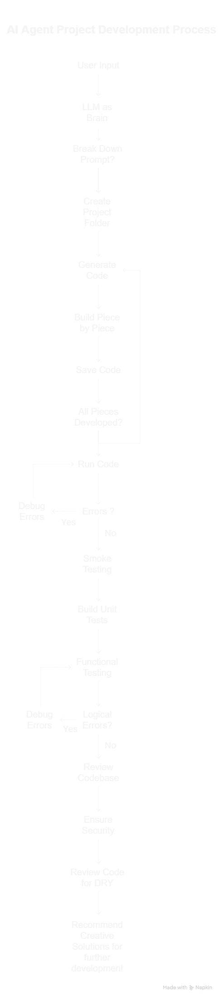

# BrahmaNirmata

My first attempt to build AI Agent from scratch!

Date: 05.05.2025

## Objective of this agent

- AI coding assistant / Personal no code AI agent
  - Chatbot that understands the problem statement
  - Build / Develop entire code base and come up with a start to end solution.
  - Debugs errors and over come them

## Flow

User inputs the problem statement for the project and also describes what the user expects as output of this prompt -> LLM acts as the brain of the agent -> Understands the prompt -> Breaks it down into smaller pieces if necessary -> creates a project folder -> generates code and builds on one piece at a time -> saves the generated code in the project folder -> Moves on to next piece of the puzzle -> repeats until all the pieces of the problem are developed and saved -> Runs the code -> Do smoke testing -> Debug errors if any -> Build unit tests -> Do functional testing -> Debug errors if any -> Reviews the entire codebase for security loop holes -> Ensure security loop holes are covered -> Review entire code base to ensure clean and DRY code -> make modifications to make it DRY if needed -> recommend further creative solutions to further develop the application.

## Features

- Ability to search internet, scrape infos through web-pages while developing and debugging
- Access to knowledge of best practices in programming
- Access to knowledge of database
- Access to knowledge of various programming languages (Python, Java, R, C++, C#, Javascript, Node js, Vue js, Bash scripting, Golang)
- Able to read entire project folder -> all files recursively
